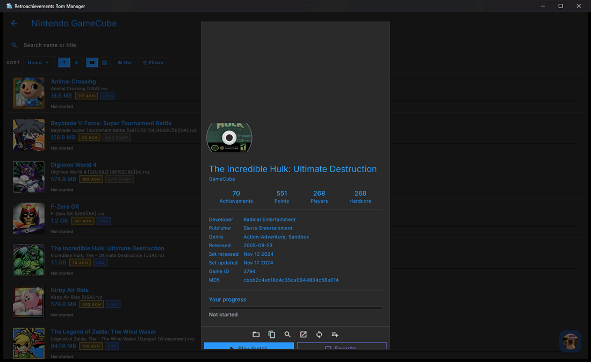
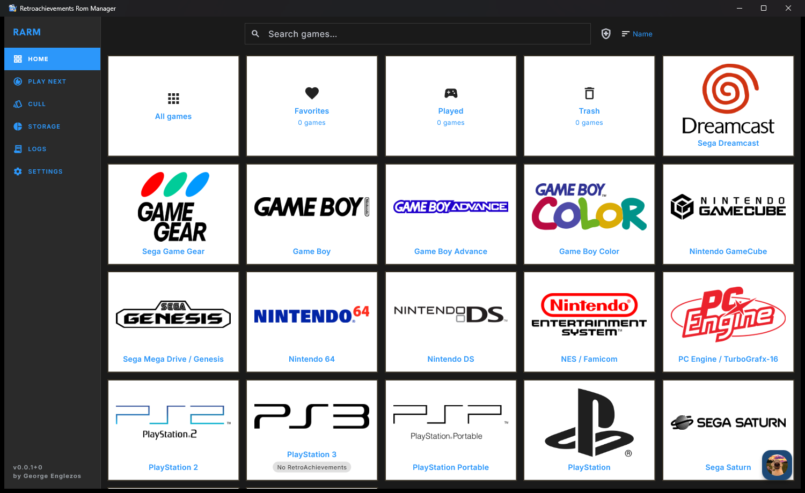
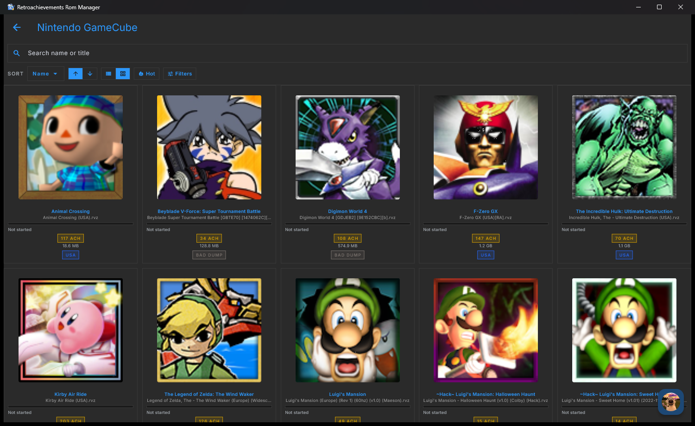
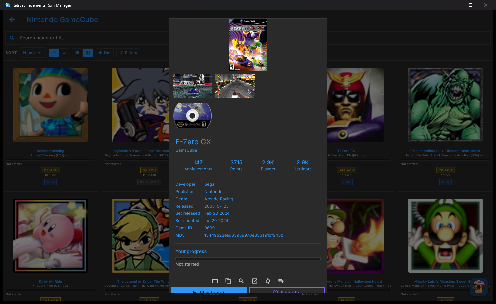
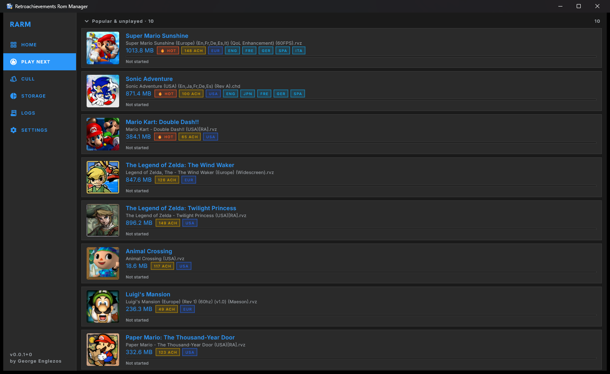
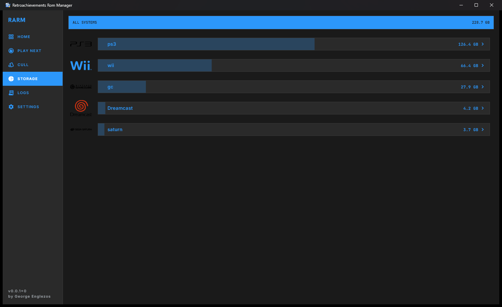
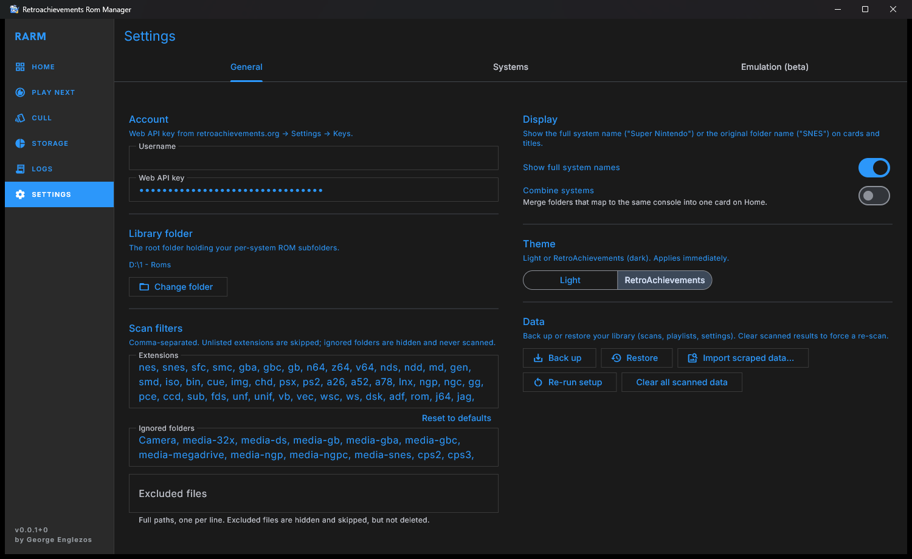
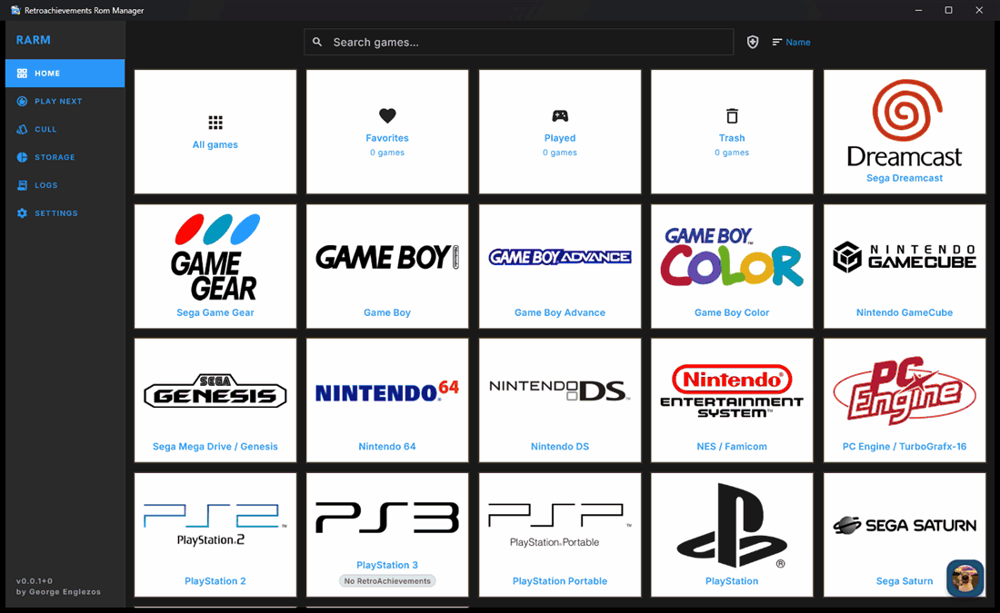
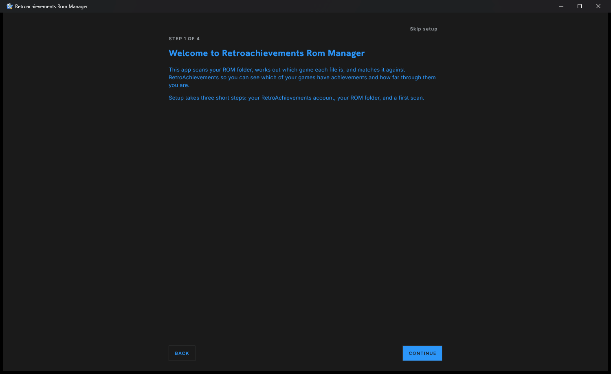

# Retroachievements Rom Manager (RARM)

[]()
[](LICENSE)
[](https://flutter.dev)

## 🎯 Overview

RARM helps you manage and clean up your ROM library. It scans your local ROMs, identifies each game and matches it against the RetroAchievements database to retrieve all the available metadata for it. In a way it acts like a retroachievements desktop and mobile client that points to your local files. You can see which games have achievements, how popular they are, and what you have already played. RetroAchievements turns out to be the most useful resource for pruning a collection. Built with Flutter, it runs natively on Windows and Android. Linux, macOS and iOS builds exist but are untested. Testers are needed for these platforms. See [Platform Support](#-platform-support).

<p align="center">
  
</p>

---

### What is RetroAchievements?

[RetroAchievements](https://retroachievements.org/) adds achievements to retro games played through supported emulators. Each game is identified by the hash of its file, and the site tracks the achievements you've earned per game.

---

## 🚀 Quick Start

### Prerequisites

- A free [RetroAchievements account](https://retroachievements.org/) and your **web API key** (found at [retroachievements.org/settings?tab=applications](https://retroachievements.org/settings?tab=applications)).
- A local library of ROMs you legally own.

### Installation

**Windows**: the easiest way to get started:

Grab the installer from the [latest release](https://github.com/GeorgeEnglezos/retroachievements-rom-manager/releases/latest)
and run it:

```
rarm-setup-vX.X.X.exe
```

**Other platforms**: download the latest build for your OS from
[Releases](https://github.com/GeorgeEnglezos/retroachievements-rom-manager/releases):

- **Windows (portable)**: `rarm-windows-vX.X.X.zip`
- **macOS**: `rarm-macos-vX.X.X.zip`
- **Linux (AppImage)**: `rarm-vX.X.X-x86_64.AppImage`
- **Linux (Flatpak)**: `rarm-vX.X.X-x86_64.flatpak`
- **Android**: `rarm-android-vX.X.X.apk`

### First Use

On first launch RARM opens a short setup wizard:

1. **Account**: enter your RetroAchievements **username** and **Web API key**, then hit **Verify** (**Get my API key** opens the right RA page)
2. **ROM folder**: pick the folder that holds all your roms; fix any console it guessed wrong, and untick any folder you don't want scanned and displayed in the app
3. **Scan**: start the first scan (or choose **Later** and scan from the home screen). The app hashes each ROM and matches it against RetroAchievements

Then start cleaning: browse by system with RetroAchievements counts on every game, and open the Cull deck to keep or bin.

That's it. Your collection is mapped to RetroAchievements and ready to prune.

---

## ✨ Key Features

- **🃏 Cull** - keep-or-bin deck, one game at a time, with RetroAchievements data on every card
- **🧹 Filters & Cleanup** - filter by system, achievement status, duplicates, region, and bad dumps; flags duplicates and misfiled ROMs
- **📤 Export** - export any system to Markdown, CSV, or PDF, plus a library health report
- **💾 Storage View** - treemap of disk usage by folder and system
- **🔍 Scanning & Hashing** - scans and identifies ROMs the way RetroArch does (zipped and disc-based included), then matches them against RetroAchievements
- **🏆 Achievement Data** - per-game achievements and your progress (casual/hardcore, points, last-played)
- **🎮 Extras** - RA-ranked "play next" picks, favorites, custom playlists, and launch ROMs into your emulator

---

## 🖼️ Screenshots

<div align="center">
  
  
</div>

<div align="center">
  
  
</div>

<div align="center">
  
  
</div>

### 🎬 In action

<div align="center">
  
  <br /><sub><b>Cull: keep or bin, one game at a time, with RetroAchievements data on every card</b></sub>
  <br /><br />
  
  <br /><sub><b>Guided first-run setup</b></sub>
</div>

## 💻 Platform Support

| Platform | Status | Notes |
|----------|--------|-------|
| Windows | ✅ Fully Supported | Windows 10/11 |
| Linux | ⚠️ Untested | AppImage & Flatpak |
| Android | ⚠️ Beta | Builds run; Everything should work except Wii and GC hashing at this point |
| macOS | ⚠️ Untested | Builds in CI but not verified on a device; the maintainer has no Apple hardware. Contributions welcome. |
| iOS | ⚠️ Untested | Builds in CI but not verified on a device; the maintainer has no Apple hardware. Contributions welcome. |

---

## 🔒 Privacy

RARM is **local-first**. Your ROM library, scan results, playlists,
and RA credentials all stay on your device.

- Only the **MD5 hash** of a ROM is sent to RetroAchievements to look up its game
  ID; the ROM file itself never leaves your machine.
- Your username and API key are used solely to fetch your own progress from the RA API.

---

## 🤝 Contributing

Contributions are welcome!

1. **Report bugs**: open an issue with clear reproduction steps
2. **Suggest features**: share ideas in the discussions
3. **Improve docs**: help make things clearer
4. **Share**: tell other RetroAchievements players about the project

---

## 📞 Support

- **Issues**: [GitHub Issues](https://github.com/GeorgeEnglezos/retroachievements-rom-manager/issues)
- **RetroAchievements**: [retroachievements.org](https://retroachievements.org/)

---

## 📜 License

Released under the [MIT License](LICENSE).

This project bundles third-party libraries inside `packages/raw_hash/src/vendor/`,
each of which stays under its own permissive license: rcheevos (MIT),
libchdr (BSD-3-Clause), and libchdr's bundled codecs zstd, miniz, lzma, and
dr_flac.

### Credits

The on-device GameCube/Wii disc hashing (CISO/WBFS/GCZ/RVZ readers in
`lib/services/` and `packages/raw_hash/`) is a Dart reimplementation of disc
formats and Wii cryptography documented by the
[Dolphin Emulator](https://dolphin-emu.org) project — its `WiaAndRvz.md` format
spec and `LaggedFibonacciGenerator` (both CC0) and the Wii disc structure
described on [WiiBrew](https://wiibrew.org). Reconstructed byte-for-byte from
those references; no Dolphin GPL code is bundled. Thanks to both projects.

RetroAchievements is a trademark of its respective owners; this is an unofficial
community tool and is not affiliated with RetroAchievements.

---

[⬆ Back to Top](#retroachievements-rom-manager-rarm)

</div>
